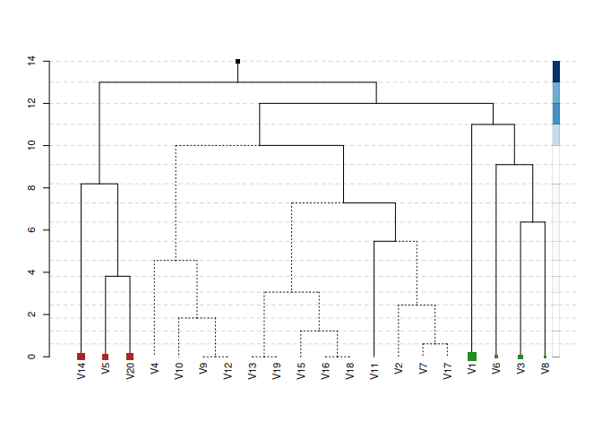

<!-- badges: start -->


<!-- badges: end -->

`hfr` is an `R` package that implements a novel graph-based regularized
regression estimator: the **Hierarchical Feature Regression (HFR)**. The
method mobilizes insights from the domains of machine learning and graph
theory to estimate robust parameters for a linear regression,
constructing a supervised feature graph that decomposes parameters along
its edges. The graph adjusts first for common variation and successively
incorporates idiosyncratic patterns into the fitting process.

The result is group shrinkage of the parameters, where the extent of
shrinkage is governed by a hyperparameter `kappa` that represents the
size of the feature graph. At `kappa = 1` the regression is
unregularized resulting in OLS parameters. At `kappa < 1` the graph is
shrunken, reducing the effective model size and regularizing the
regression.

## Usage: at a glance

Fit a linear regression using simulated data from the `glmnet` package:

``` r
library(hfr)

data("QuickStartExample", package = "glmnet")
data <- QuickStartExample

mod <- hfr(data$x, data$y, kappa = 0.75)
print(mod)
```

    ## 
    ## Call:  hfr(x = data$x, y = data$y, kappa = 0.75) 
    ## 
    ##   Df R.squared kappa
    ## 1 16      0.91  0.75

Cross-validation to select an optimal `kappa` can be done using
`cv.hfr`. The default in `cv.hfr` is a 10-fold CV, however, we will pass
`foldid` to use an LOOCV algorithm:

``` r
cv <- cv.hfr(data$x, data$y, foldid = 1:nrow(data$x))
mod <- hfr(data$x, data$y, kappa = cv$best_kappa)
```

The HFR offers useful tools for the visual exploration of the effect
structure in the data. The package includes a custom dendrogram
visualizing the optimal feature graph. See `?plot.hfr` for details:

``` r
par(family = "sans", cex = 0.7)
plot(mod, confidence_level = 0.95, max_leaf_size = 2, show_details = FALSE)
```



The plot displays the optimal supervised feature graph. The size of the
tree represents the effective model size — in this case reducing the
model from `p = 20` variables to an effective size of `14` variables.
The plot conveys a wealth of additional information:

- Adjacent variables that are merged low in the graph have a similar
  conditional explanatory effect on `y`
- The vertical distance between levels indicates the weight of the
  levels in the regression
- The size of the leaf nodes represents the coefficient size and the
  color represents the sign
- Dashed edges are statistically insignificant (see `?se.avg` for
  standard errors)
- Darker hues in the sidebar signify a higher contribution of that level
  to total explained variance

Standard functions such as `coef`, `predict` and `print` can be used to
interact with fitted `hfr` or `cv.hfr` objects.

## Installation

    # CRAN
    install.packages("hfr")

    # Latest Dev version
    devtools::install_github("https://github.com/jpfitzinger/hfr")

## References

Pfitzinger, J. (2024). Cluster Regularization via a Hierarchical Feature
Regression. *Journal of Econometrics and Statistics* (in press).
<https://doi.org/10.1016/j.ecosta.2024.01.003>.
