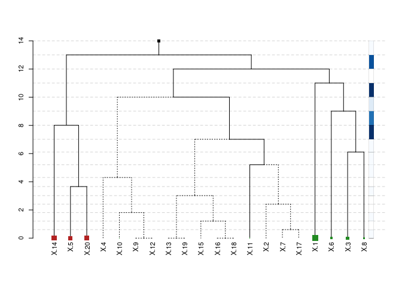

`hfr` is an R package that implements a novel graph-based regularized
regression estimator: the **Hierarchical Feature Regression (HFR)**,
which mobilizes insights from the domains of machine learning and graph
theory to estimate robust parameters for a linear regression. The
estimator constructs a supervised feature graph that decomposes
parameters along its edges, adjusting first for common variation and
successively incorporating idiosyncratic patterns into the fitting
process.

The result is group shrinkage of the parameters, where the extent of
shrinkage is governed by a hyperparameter `kappa` that represents the
size of the regression graph. At `kappa = 1` the regression is
unregularized resulting in OLS parameters. At `kappa < 1` the graph is
shrunken, leading to a reduction in the effective model size.

## Usage: at a glance

Fit a simple regression using simulated data from the `glmnet` package:

``` r
library(hfr)

data("QuickStartExample", package = "glmnet")
data <- QuickStartExample

mod <- hfr(data$x, data$y, kappa = 0.75)
print(mod)
```

    ## 
    ## Call:  hfr(x = data$x, y = data$y, kappa = 0.75) 
    ## 
    ##   Df R.squared kappa
    ## 1 16      0.91  0.75

Next select an optimal `kappa` using LOOCV. The default in `cv.hfr` is a
10-fold CV, hence `foldid` is passed:

``` r
cv <- cv.hfr(data$x, data$y, foldid = 1:nrow(data$x))
mod <- hfr(data$x, data$y, kappa = cv$best_kappa)
```

The HFR offers useful tools for the visual exploration of the effect
structure in the data. The package includes a custom dendrogram
visualizing the optimal regression graph. See `?plot.hfr` for details:

``` r
plot(mod, confidence_level = 0.95, max_leaf_size = 2)
```



The plot shows the optimal regression graph. The size of the tree
represents the effective model size and reduces the model from `p = 20`
variables to `14`. The plot conveys a wealth of additional information:

-   Adjacent variables and variables that are merged low in the graph
    have a similar explanatory effect on `y`
-   The horizontal distance between levels indicates the weight of that
    level in the regression
-   The size of the leaf nodes represents the coefficient size and the
    color represents the sign
-   Dashed edges are statistically insignificant (see `?se.avg` for
    standard errors)
-   Darker shades in the sidebar signify a higher contribution of that
    level to the total explained variance

Standard functions such as `coef`, `predict` and `print` can be used to
interact with fitted `hfr` or `cv.hfr` objects.

## Installation

    # CRAN
    install.packages("hfr")

    # Latest Dev version
    devtools::install_github("https://github.com/jpfitzinger/hfr")

## References

Pfitzinger, J. (2021). Cluster Regularization via a Hierarchical Feature
Regression. *arXiv 2107.04831\[statML\]*
